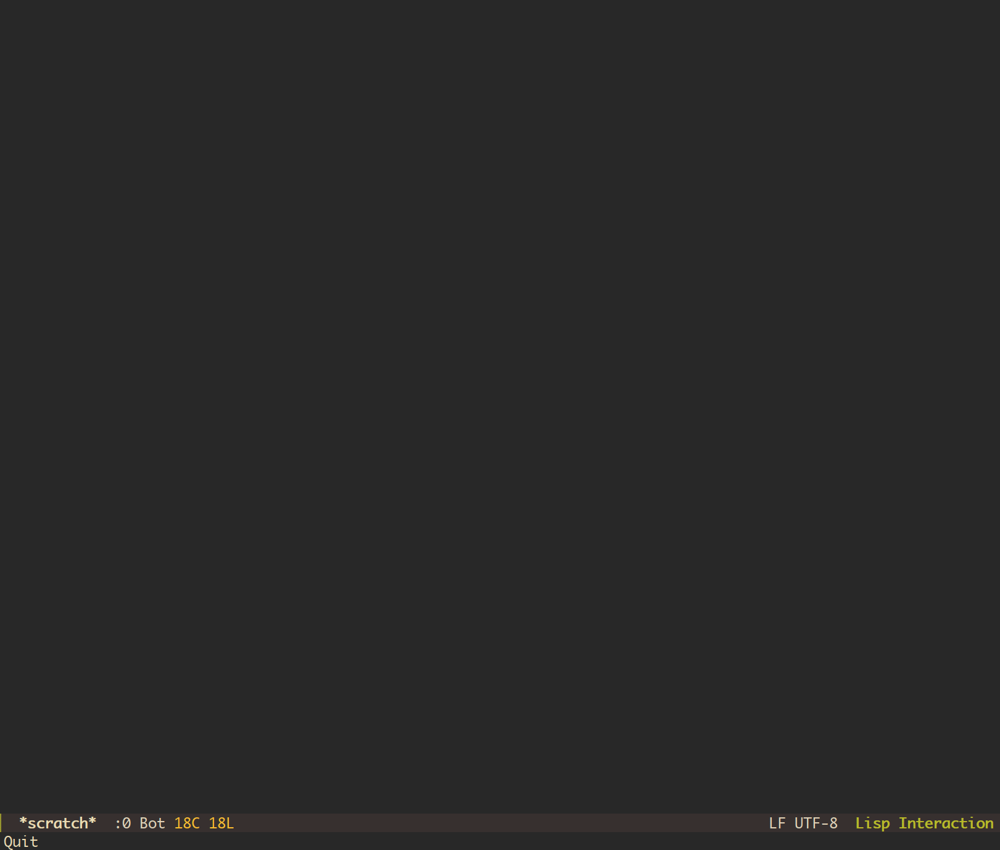

# Ivy-hoogle

`ivy-hoogle` is a package for [Emacs][emacs] that provides an
[Ivy][swiper]-based interface to [Hoogle][hoogle].

[emacs]: https://www.gnu.org/software/emacs/
[swiper]: https://oremacs.com/swiper/
[hoogle]: https://github.com/ndmitchell/hoogle/

## Prerequisites

At present, `ivy-hoogle` only supports querying using the Hoogle [CLI
utility][hoogle-cli]. As such, the `hoogle` executable needs to be in
`PATH`. Alternatively, `ivy-hoogle-program` can be customized to point to it.

[hoogle-cli]: https://github.com/ndmitchell/hoogle#command-line-version

## Installation

### MELPA

`ivy-hoogle` is available on [MELPA][melpa].

[melpa]: https://melpa.org/#/getting-started

### From Git

#### Using the Emacs package system

```elisp
(package-vc-install
  '(ivy-hoogle :url "https://github.com/aartamonau/ivy-hoogle.git"))
```

#### Using [straight.el][straight]

```elisp
(straight-use-package
  '(ivy-hoogle :type git :host github :repo "aartamonau/ivy-hoogle"))
```

[straight]: https://github.com/radian-software/straight.el

## Commands

The package currently provides two commands.

 -   `ivy-hoogle`

     This is the main command that starts a new `ivy-hoogle` session. The user
     input is fed to the Hoogle CLI. The results are shown in the minibuffer.

     I have this command bound globally like so:

     ```elisp
     (use-package ivy-hoogle
       :bind (("C-. i" . ivy-hoogle)))
     ```

     The default action will open a help buffer with the documentation for the
     selected candidate.

     The alternative action (`ivy-alt-done`, bound to `C-j` by default) will
     open the documentation for the selected candidate in the external browser
     using `browse-url-secondary-browser-function`. This is useful when the
     documentation returned by the Hoogle CLI is incomplete or has messed up
     formatting.

     The following `ivy` features should work:

     *   `ivy-occur` (`C-c C-o` by default)

         Will open the current candidates in an occur buffer.

     *   `ivy-avy` (`C-'` by default)

         Allows choosing the candidate using [avy][avy].

     *   Multi-selection (`ivy-mark` and `ivy-unmark`, `C-o` and then `m` or
         `u` by default)

         Convenient in combination with the alternative action that would open
         documentation for all of the selected candidates in the external
         browser.

     *   `ivy-resume`

         Will restore the last `ivy` session, including `ivy-hoogle` sessions.

     *   `ivy-restrict` (`S-SPC` by default)

         Fixes the current set of candidates that can then further be
         restricted to those that match the input regex.

 -   `ivy-hoogle-thing-at-point`

     This command acts just like `ivy-hoogle` but it also uses the value of
     the symbol at point as the initial input for the session. So it makes
     most sense to bind it in `haskell-mode`. For instance:

     ```elisp
     (use-package haskell
       :bind (:map haskell-mode-map
                   ("C-. H" . ivy-hoogle-thing-at-point)))
     ```

[avy]: https://github.com/abo-abo/avy

## Screenshot


